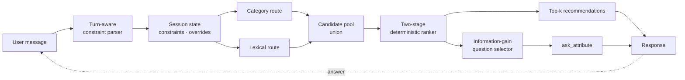

# EntropyShop

**TikTok TechJam 2026 — Track 4: Shopping Copilot (AI Conversational Search and Recommendations)**

An information-theoretic conversational shopping agent. It treats finding a
customer's hidden target as **active preference elicitation**: maintain a
posterior over catalog candidates, recommend the best ones every turn, and
spend each clarification question where it buys the most information.

No LLM at runtime. No network. Zero tokens. Fully deterministic.

| Metric | Official baseline | **EntropyShop** |
|---|---|---|
| Hit Rate@10 | 0.125 | **1.000** |
| MRR | 0.068 | **0.932** |
| MTTC | 9.81 | **2.19** |
| Efficiency | 0.119 | **0.881** |
| **TechnicalScore** | **0.10671** | **0.95583** |
| Token usage | 0 | **0** |
| Per-turn latency | — | **42 ms** mean / 101 ms p95 |

Measured with the **unmodified** official evaluator over all 200 public
sessions. Under a paraphrasing customer (`scripts/stress_paraphrase.py`) the
score holds at **0.928** — see [Robustness](#robustness).

---

## The idea

The customer never names the product. They name **requirements**, and each one
removes probability mass from the candidate set. So the question we ask matters
more than the query we run.

Three measurements taken before writing the agent shaped the whole design:

1. **The opening line names the item's category** — that alone cuts 50,000
   products to a median of 184.
2. **Requirements are short phrases quoted from the target's own metadata** —
   so exact phrase containment is near-decisive.
3. **Knowing 1 / 2 / 4 requirements gives 0.325 / 0.675 / 0.935 Hit Rate** under
   a deliberately crude ranker.

Point 3 is the crux: *acquiring requirements quickly beats ranking
sophistication*. Hence entropy-guided questioning.

Each turn the agent scores every allowed attribute by expected value of
information and asks the best one — while returning recommendations in the same
response, because the contract permits both.

```
H(C)      = -Σ p(c) log₂ p(c)
IG(a)     = H(C) - Σ_v P(v)·H(C | v)

Utility(a) = w_ig·IG + w_top10·Δtop10 + w_mrr·ΔRR + w_coverage·answerability
           + w_discover·discovery − w_missing·P(no preference)
           − w_repeat·exhausted − w_turn
```

**Why not raw entropy?** `brand` is the clearest trap: brands are highly
distinctive, so a brand question scores high raw information gain — but this
customer never volunteers one, so the answer is always "no preference" and the
turn is burned. The `answerability` term, derived from a customer model built
from catalog metadata, is what correctly demotes `brand` and `category` beneath
`material` and `feature`.

## Architecture



Full detail, including failure paths and the three non-obvious design
decisions, is in **[docs/ARCHITECTURE.md](docs/ARCHITECTURE.md)**.

## Setup

EntropyShop is verified on **Python 3.11.16** and supports Python 3.10+. The
agent runtime itself needs no third-party package; `pytest` is included only
for development and verification.

```bash
git clone https://github.com/ronakkalvani/techjam-conversational-search.git
cd techjam-conversational-search

# Create the reproducible development environment
conda env create -f environment.yml
conda activate entropyshop

# Download and verify the frozen catalog (50,000 products)
curl -L -o data/catalog.jsonl.gz \
  https://github.com/TechJam2026/techjam-conversational-search/releases/download/participant-kit/catalog.jsonl.gz
python -c "import hashlib,pathlib; p=pathlib.Path('data/catalog.jsonl.gz'); assert hashlib.sha256(p.read_bytes()).hexdigest() == '07fd142631fd6b03e2b4d09988c3eb7d53720e9d57010c79db48eeaada50a8f8'; print('catalog checksum OK')"
gunzip -k data/catalog.jsonl.gz
wc -l data/catalog.jsonl        # expect 50000
```

## Reproducing our results

```bash
# Video-friendly single session using the official customer protocol
python scripts/demo_session.py --sample-id public_0094

# Official evaluator — the number we report
python -m evaluator.local_evaluator \
    --catalog data/catalog.jsonl --dataset data/public_set.jsonl --output results.json

# Same run with latency and per-scenario breakdown
python scripts/run_eval.py --label entropyshop --output results.json

# Tests
python -m pytest tests/ -q

# Full ablation grid (~15 min)
python scripts/compare_policies.py

# Error analysis and robustness
python scripts/inspect_errors.py
python scripts/stress_paraphrase.py --mode paraphrase
```

The demo command runs against the real 50,000-product catalog and prints each
customer turn, the agent's clarification field, titled recommendations,
latency, and the final hidden-target reveal. Omit `--sample-id` to use the
first sample for a scenario, or choose another official scenario:

```bash
python scripts/demo_session.py --scenario intent_override
python scripts/demo_session.py --scenario boundary
```

## Results by scenario

| Scenario | n | Hit@10 | MRR | MTTC |
|---|---|---|---|---|
| Buying | 80 | 1.000 | 0.964 | 1.75 |
| Browsing | 80 | 1.000 | 0.931 | 1.96 |
| Intent Override | 30 | 1.000 | 0.865 | 3.73 |
| Boundary | 10 | 1.000 | 0.883 | 2.90 |

Intent Override's MTTC of 3.73 is close to its structural floor: those sessions
cannot convert before the override arrives on turn 3 or 4.

Error analysis: **178/200 at rank 1**, 20 at rank 2–3, 2 at rank 4–10, no
misses.

## What each ablation bought

| Change | Score |
|---|---|
| Official BM25 baseline | 0.107 |
| Lexical retrieval only | 0.085 |
| **+ category route** | **0.407** |
| + facet scoring | 0.821 |
| + phrase containment | 0.862 |
| + adaptive questioning | 0.875 |
| + previously-shown exploration | 0.887 |
| − profile prior *(it hurt)* | 0.883 |
| **+ ramped recommendation budget** | **0.956** |

Two results changed the design rather than decorating a table:

- **The aggregate user profile actively hurts** (−0.02). Tags like `fit` and
  `comfort` match generic apparel copy everywhere, so despite a weight of 0.02
  it behaves as a near-random tie-breaker. It ships **off**, by evidence.
- **Turn-1 hits had the *worst* mean rank** (0.550), because they are found with
  the least evidence. Ramping the budget `(1,2,3,5,10)` — showing fewer
  candidates early — moved MRR from 0.642 to 0.932 with Hit Rate unchanged.

Full grid: **[docs/EXPERIMENTS.md](docs/EXPERIMENTS.md)**.

## Robustness

The specification warns the organizer may paraphrase the private simulator. A
parser tuned to exact templates would look excellent here and collapse there,
so we tested it: `scripts/stress_paraphrase.py` re-runs the documented protocol
with paraphrased wording and identical scoring.

| Wording | Before hardening | After |
|---|---|---|
| Template (control, matches official) | 0.95878 | 0.95583 |
| **Paraphrased** | **0.74187** | **0.92838** |

The first run exposed real over-fitting: `"Hoping to find X"` extracted **no
category at all** because `find` was not a trigger verb. The fix was structural,
not more regexes — parsing became **turn-aware**, so turn 1 is always the
opening and every later turn is a reply, meaning anything not recognised as a
refusal or override is read as a requirement. Cost: 0.003 on the public set.
Benefit: 0.187 under paraphrase.

## Limitations and what we would do next

- **Zero misses on 200 public sessions is not a promise of zero on 800
  private ones.** We report it as "no misses on the public set".
- **The `(1,2,3,5,10)` budget is a deliberate bet on high Hit Rate.** It shows
  21 products across five turns versus 50 for a flat budget. If private Hit
  Rate is materially below 1.0 this ramp converts hits into misses, and Hit
  Rate carries 0.50 weight. `policy.turn_budget=(3,5,10)` is measured and
  ready; it is the first dial to turn.
- **The customer model may not transfer.** Question *selection* would degrade
  if the private simulator discloses differently; ranking would not, since it
  scores whatever text actually arrives, and exhausted attributes are learned
  within the session regardless.
- **No semantic retrieval.** Purely lexical, so a genuine synonym gap
  (`sneakers` vs `trainers`) is only partly covered by the facet vocabularies.
  A small offline embedding index is the natural next step, and is the change
  most likely to help on unseen phrasings.
- **Facet vocabularies are hand-built** for Clothing/Shoes/Jewelry and would
  need extending for another category tree.

## Three-minute demo script

1. **The problem** (20 s) — 50,000 products, a hidden target, 10 turns.
   Baseline BM25 scores 0.107.
2. **The insight** (30 s) — the customer states requirements, not products.
   Show the headroom table: 1 → 2 → 4 requirements gives 0.325 → 0.675 → 0.935.
   So *asking well* beats *ranking harder*.
3. **Live session** (60 s) — run
   `python scripts/demo_session.py --sample-id public_0094`. Walk the
   buying session: category resolves the bucket, the agent asks the
   highest-information attribute, the answer collapses the posterior, target
   lands at rank 1 by turn 2.
4. **Why not raw entropy** (30 s) — the `brand` trap: high information gain,
   zero answerability. Show `answerability` demoting it.
5. **Robustness** (30 s) — the paraphrase test: 0.742 → 0.928 after making
   parsing turn-aware. We found our own over-fitting and fixed it.
6. **Numbers and honesty** (10 s) — 0.956, 42 ms, zero tokens, plus the
   Hit-Rate bet we are explicit about.

## Repository layout

```
starter/            agent runtime (no evaluator import, no labels)
  agent.py          official Agent interface + orchestration
  config.py         every tunable weight
  catalog.py        immutable indexes
  constraints.py    turn-aware parsing, override semantics
  questions.py      entropy and question utility
  policies.py       fixed / entropy / other_first / hybrid
  ranking.py        two-stage deterministic fusion
  retrieval.py      category + lexical routes
  facets.py         vocabularies and constraint typing
  state.py          per-session belief
  text.py           tokenisation
  explanations.py   fixed question templates
scripts/            demo_session · run_eval · compare_policies · tune_config
                    inspect_errors · stress_paraphrase
tests/              50 tests (44 agent + 3 demo + 3 official evaluator)
docs/               ARCHITECTURE.md · EXPERIMENTS.md
```

## Compliance

- Official `Agent` interface preserved; evaluator, catalog, public set, API
  contract and baseline files unmodified.
- Runtime imports no evaluator internals and reads no labels — enforced by
  AST-level tests, not grep.
- No hard-coded ASINs, sample IDs or answer sequences — enforced by test.
- No secrets, no credentials, no network access required.
- Deterministic: identical inputs produce identical output.

## Team contributions

| Member | Contribution |
|---|---|
| Kalvani Ronak Sunilbhai | Agent architecture and implementation; retrieval, ranking, adaptive questioning, parsing, evaluation, testing, and technical documentation |
| Aniket Khan | Problem framing, solution review, and demo and presentation support |
