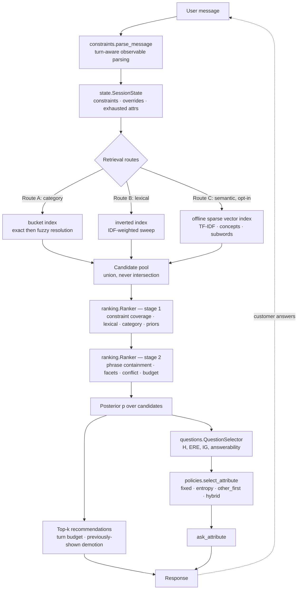

# EntropyShop — Architecture

## The problem, stated precisely

A simulated customer has a hidden target product in a frozen 50,000-item
catalog. They open with a vague or partly-specified request and answer one
structured clarification question per turn. We have ten turns. Only the first
ten valid unique `parent_asin` values are scored, and the session ends the
moment the target appears.

`TechnicalScore = 0.50·HitRate@10 + 0.30·MRR + 0.20·Efficiency`

So three things must be true at once: the target must be reachable (Hit Rate),
it must be near the top when found (MRR), and it must be found early
(Efficiency). These pull against each other, and the design is mostly about
where to spend a turn.

## The insight

The customer never states the product. They state *requirements*, two at a
time, and each requirement removes probability mass from the candidate set.
That makes the task an **active preference elicitation** problem, not a search
problem: the question we ask matters more than the query we run.

So the agent maintains a weighted posterior over candidates and, each turn,
asks the question with the highest **expected value of information** — while
simultaneously returning its best current recommendations, because asking and
recommending are not mutually exclusive under the contract.

Three empirical facts, measured before any code was written, shaped everything:

| Finding | Consequence |
|---|---|
| The opening line names the target's own category path (50,000 → median 184 candidates) | Category resolution is the single largest lever |
| Requirements are short phrases quoted from the target's own metadata | Exact phrase containment is near-decisive; IDF token coverage is the robust fallback |
| Knowing 1 / 2 / 4 requirements yields 0.325 / 0.675 / 0.935 Hit Rate under a crude ranker | Acquiring requirements *fast* dominates ranking sophistication |

## Pipeline



## Final submission mode

The submitted configuration keeps `use_intent_policy` and
`use_semantic_route` disabled. This is the measured baseline: category and
lexical retrieval, deterministic two-stage ranking, explicit session state,
and information-gain clarification. The intent-conditioned and sparse-vector
routes remain available as reproducible ablations, but they are not part of the
reported final score because they reduced the held-out public guard.

## Layers and responsibilities

| Module | Owns | Deliberately does not |
|---|---|---|
| `config.py` | Every tunable weight, in one dataclass | Read env, clock or randomness |
| `text.py` | Tokenising, normalising, conservative stemming | Any catalog knowledge |
| `facets.py` | Apparel vocabularies, facet extraction, constraint typing | Invent values not supported by metadata |
| `catalog.py` | Immutable indexes: postings, buckets, priors, predicted constraints | Mutate the source file |
| `constraints.py` | Turn-aware parsing, constraint records, override semantics | Raise on malformed input |
| `state.py` | Per-session belief, fully isolated | Share anything across sessions |
| `retrieval.py` | Category/lexical pool plus optional semantic vector route | Hard-filter the target away |
| `semantic.py` | Offline sparse vector features and cosine candidate scores | Download a model or call a service |
| `ranking.py` | Two-stage deterministic fusion with optional intent weights | Call a model |
| `questions.py` | Entropy, expected residual entropy, question utility | Read labels or evaluator state |
| `policies.py` | Which question to ask, and when to stop asking | Hard-code a session-specific sequence |
| `explanations.py` | Fixed customer-facing templates | Sample or generate text |
| `agent.py` | Official interface, orchestration only | Contain reasoning |

## Decision policy

Over candidates `C` with normalised weights `p(c)`:

```
H(C)      = -Σ_c p(c) log₂ p(c)
ERE(a)    =  Σ_v P(v) · H(C | answer group v)
IG(a)     =  H(C) - ERE(a)

Utility(a) =  w_ig       · normalised_information_gain(a)
           +  w_top10    · expected_top10_mass_gain(a)
           +  w_mrr      · expected_reciprocal_rank_gain(a)
           +  w_coverage · answerability(a)
           +  w_discover · discovery_bonus(a)
           -  w_missing  · missing_value_probability(a)
           -  w_repeat   · repeated_or_exhausted_penalty(a)
           -  w_turn     · additional_turn_cost
```

### Why raw entropy is not enough

`brand` is the clearest case. Brands are highly distinctive, so a brand
question would partition the catalog beautifully and scores high raw
information gain — but this customer never volunteers a brand, so the answer is
always "no preference" and the turn is wasted.

`answerability(a)` fixes this. Answer groups come from a **customer model**:
for each candidate product we predict the short requirements its owner would
still quote, type each one, and group candidates by the answer that a question
about `a` would elicit. An attribute nobody can answer collapses into a single
"no preference" group, giving zero information gain *and* zero answerability.
That is why `material` and `feature` beat `brand` and `category` in practice,
and it is derived from catalog metadata rather than hard-coded.

Multi-valued facets are approximated with weighted outcome buckets plus an
explicit missing/unknown bucket, and the whole estimate runs over the top
`entropy_pool` (200) candidates so per-turn cost stays bounded.

## Three decisions worth explaining

### 1. Previously-shown demotion

If a product appeared in a scored top-10 and the session is still running, the
protocol guarantees it was **not** the target. Demoting it turns each turn into
a fresh draw of unseen candidates.

This is free in intent-override sessions: those cannot convert before the
override arrives, so pre-override turns cost nothing, and the suppression list
is cleared when the override is detected. Demotion is a large finite penalty
rather than exclusion, so a small pool degrades to a re-show instead of an
empty list. Worth +0.012 TechnicalScore and it lifts Hit Rate from 0.985 to
1.000.

### 2. Ramped recommendation budget `(1, 2, 3, 5, 10)`

The counterintuitive diagnostic: turn-1 hits had the *worst* mean reciprocal
rank (0.550), because they are found with the least evidence. A target sitting
at rank 7 today is usually rank 1–2 tomorrow, once its ten rivals are demoted
and one more requirement is known.

The arithmetic favours waiting — MRR carries 0.30 weight while one extra turn
costs only 0.02 TechnicalScore via Efficiency. Measured: MRR 0.642 → 0.932 with
Hit Rate held at 1.000. This is the most aggressive setting in the design and
the one most worth revisiting if private-set Hit Rate is below 1.0; see the
generalisation notes in `EXPERIMENTS.md`.

### 3. Category is a boost, never a filter

Resolving the spoken category to a bucket is the strongest signal available,
but making it an exclusive filter would let one parsing miss destroy a session
permanently. The bucket route and the lexical route are therefore **unioned**,
and bucket membership contributes an additive score. Resolution falls back from
exact match to case-insensitive match to Jaccard token overlap.

## Failure and recovery paths

| Condition | Behaviour |
|---|---|
| Unparseable message | Becomes lexical evidence; `kind = "statement"` |
| Category unresolvable | Lexical route alone; pool never empty |
| Attribute answered "no preference" | Marked blocked; never re-asked |
| All attributes exhausted | `ask_attribute = null`, recommendations continue |
| Intent override | Old constraint deactivated (not deleted), replacement added hard, suppression list cleared, exhausted set reset |
| Exception anywhere in `respond` | Contract-valid safe response |
| `respond` before `reset` | Session auto-created rather than raising |

Overridden constraints are retained at reduced weight rather than deleted: the
customer originally described the same product, so the retired text is still
weak evidence — but it can no longer exclude anything.

## Runtime characteristics

| Property | Value |
|---|---|
| Catalog init | ~9.6 s (once, final release run) |
| Memory | ~360 MB resident |
| Per-turn latency | 39.27 ms mean, 84.88 ms p95 (final release run) |
| Token usage | 0 — no model at runtime |
| Network | none |
| Determinism | total; ties break on `parent_asin` |

Memory is dominated by interned integer postings and lowercase product text.
Facet extraction is lazy and cached, so it only ever touches shortlisted
products. Stage 2 scoring runs on 300 candidates, not the whole pool.
